### Hi, I’m Danya ✨
Data scientist / fan of k-dramas
 

- 🛠️ Building data apps to empower workers, advocates, and researchers @ [TechEquity](https://techequity.us/people/danya-sherbini/)
- 💻 I use daily: `python`, `postgreSQL`, `docker`, `css`, `next.js`, `react.js`
- 🧰 Current and recent work projects:
  - ⚖️ [CA Legislation Tracker](https://github.com/techequitycollaborative/legislation-tracker)
  - 📝 [2025 California State AI Bills Analysis](https://github.com/techequitycollaborative/2025-ai-bills-analysis)
  - 🌎 [Data Work Landscape](https://github.com/techequitycollaborative/ai-data-work-landscape)
- 👩🏻‍💻 Current and recent personal projects:
  - ☂️ [Kdrama-rama](https://github.com/dsherbini/kdrama-recommendations)

 
 

<!---
dsherbini/dsherbini is a ✨ special ✨ repository because its `README.md` (this file) appears on your GitHub profile.
You can click the Preview link to take a look at your changes.
--->
